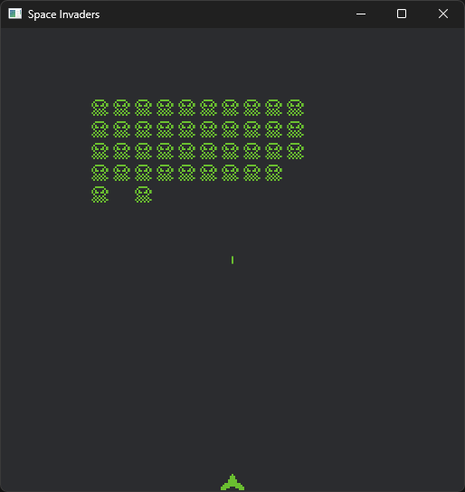

# space_invaders_bevy

A 2D Game created in Rust with bevy to study. 👾

## ⚙️ Tools

- 🕹️ **bevy** - Game engine and app framework

## 🚀 Getting started

Make sure that you have Rust installed; 
Clone the repository in your machine; 
Open the repository with your terminal and run the following command:

1. `cargo run`;

The game will automatically open on your computer; 
Have fun!! 🔥

---

Made with ♥ by Vilson Castilho
